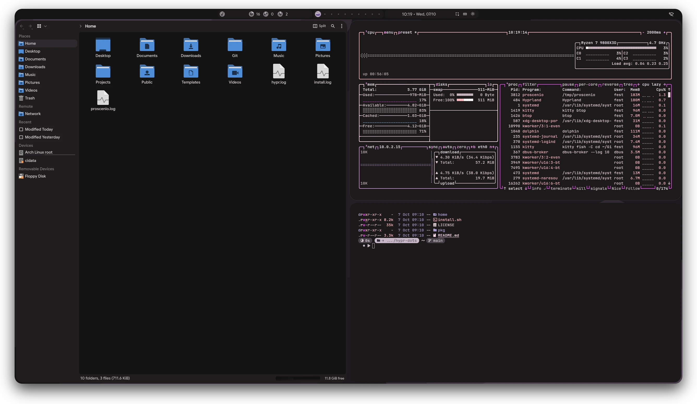

# hypr-dots

Configs for a Hyprland desktop on Arch Linux with the [proscenio](https://github.com/The1fEst/proscenio)
shell, and an installer for the packages they need.



| | |
|---|---|
|  |  |

## Install

```bash
./install.sh
```

runs every step in order. Each step also runs on its own, and running one again is safe:

| Command | What it does |
|---|---|
| `./install.sh packages` | installs `paru` if it is missing, builds and installs the shell from proscenio's `packaging/PKGBUILD` and the `hypr-dots` meta package from `pkg/`, and removes the `illogical-impulse-*` packages it replaces |
| `./install.sh configs` | copies the configs in `home/` into `$HOME`, enables the session's user units and records the commit it installed |
| `./install.sh system` | adds the user to `video`, `i2c` and `input`, loads `i2c-dev`, enables ydotool, Bluetooth and NetworkManager, sets the default apps, the GTK font and dark scheme and the Darkly Qt style, and installs Google Sans and Google Sans Flex |
| `./install.sh diff` | shows how the configs in `$HOME` differ from `home/` |

The shell's PKGBUILD is downloaded into `~/.cache/proscenio/package` and builds `main` of
`The1fEst/proscenio`, the same way the shell's own Shell update button does.

## Configs

`configs` copies two kinds of file:

- **Managed**: Hyprland, hyprlock, hypridle, fish, kitty, starship, fuzzel, wlogout, matugen, the
  Hyprland portal choice, the VS Code flags and the session's systemd user units. A copy in `$HOME`
  that differs from `home/` is saved under `~/.local/state/hypr-dots/backup/<time>/` first, then
  replaced. Directories are mirrored, so a file removed from `home/` goes from `$HOME` too, except the
  colors matugen writes into `~/.config/hypr/hyprland/colors.lua` and
  `~/.config/hypr/hyprlock/colors.conf`.
- **Seeded**: `~/.config/hypr/custom`, `fontconfig/fonts.conf`, `kdeglobals`, `dolphinrc`,
  `darklyrc`, `btop/btop.conf` and `~/.local/state/dolphinstaterc` are copied only when they do not
  exist yet, since the apps and the machine's own Hyprland tweaks change them. `btop.conf` sets the
  `TTY` theme, which draws with the terminal's colors and so follows the wallpaper.

A change made in `home/` reaches `$HOME` on the next `./install.sh configs`. A change made in
`$HOME` shows in `./install.sh diff` and is overwritten by the next `configs`, after its backup.

`hyprland.lua` loads each `~/.config/hypr/custom/*.lua` after the matching part of the shared config,
so that folder is the place for one machine's monitors, binds and rules.

The session's units are `proscenio`, `hypridle`, `cliphist-text`, `cliphist-image`,
`wl-clip-persist` and the `hypr-dots-check` timer, all wanted by `hyprland-session.target`.

## Updates

`configs` writes the clone's path and its commit to `~/.local/state/hypr-dots/installed`. Five
minutes into the session and every six hours after, `hypr-dots-check.timer` runs
`~/.local/bin/hypr-dots-check`, which fetches the clone's upstream branch and counts the commits it
has past the installed one. When there are any, it notifies once for each new upstream head, with
an **Update** action that opens kitty on `git pull --ff-only` and `./install.sh configs` in the
clone. A clone with no upstream branch, or no network, is left alone.

## License

GPL-3.0. Much of `home/.config/hypr` and of the matugen templates started in
[end-4/dots-hyprland](https://github.com/end-4/dots-hyprland).
